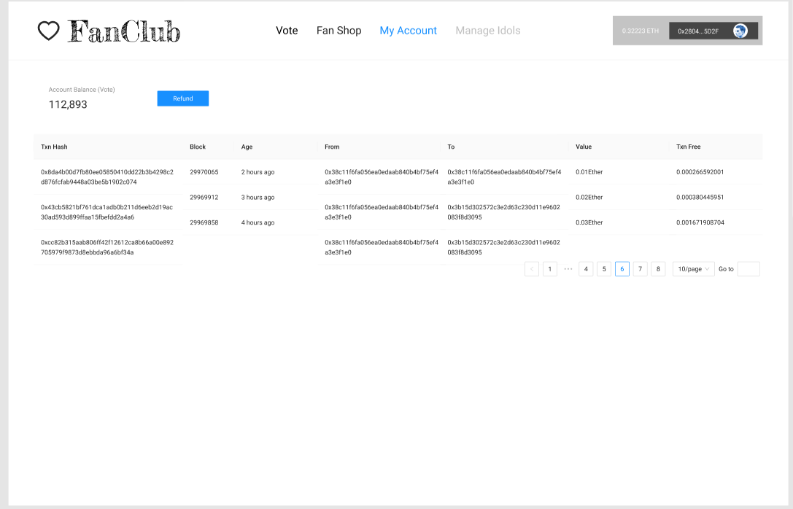
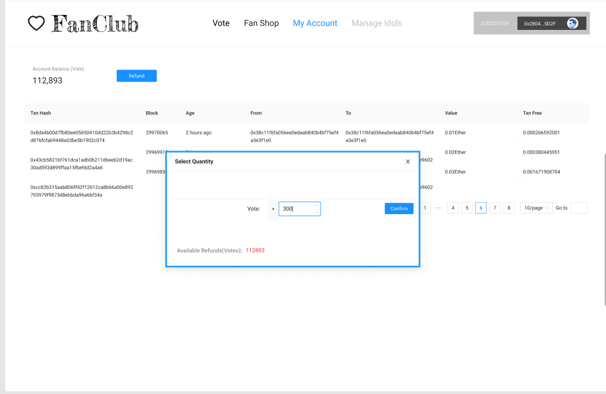
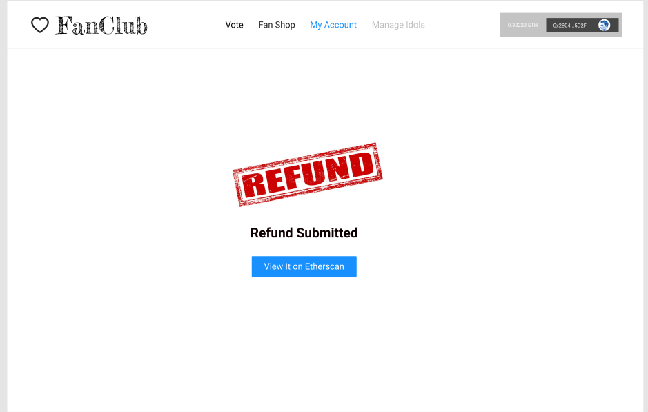

# Fans Club


## Team Members
Linger Shen

Lei Lu

Qianhui Jiang

Zhuomin Hao

## Introduction
**Fans club is a platform where fans can vote for their favorite stars with gifts exchanged by ethereum.**

The core functionalities include:

#### Vote

- The carousel displays the top 3 winners voted by the fans.

  

- The bar chart displays vote result. 

  

- And the fans could also vote their idols in this page.

  

#### Fan Shop

- The fan could buy gifts in fan shop. The gift is the tokens used to vote idols.

  

<!--Original Content below:-->

- Tokens can also be refund if they haven'e been used to vote.
- Only the admin can publish stars.
- Fans can get their transaction history including vote/buy/refund.

#### Manage Idols

- The administrator can upload a new idol information.

  

#### My Account

- My account page shows the transactions and the account balance.

  

- User could refund the vote tokens.

  

- Refund confirm page shows the result of refund.

  

## How to Run 

Run React frontend

```shell
npm install
npm start
```
Hardhat smart contract test:
```shell
npx hardhat test
```
